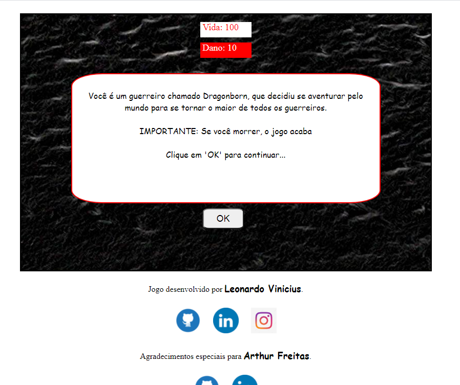

# O Aventureiro 🎮

## Jogo criado por Leonardo Vinicius

**O Aventureiro** é um jogo de tomada de ações, onde você decide como vai ser o rumo da história, clicando na decisão desejada. É um jogo à moda antiga, criado apenas com o objetivo de aprender mais sobre o *Javascript*, pois é o primeiro jogo que eu desenvolvi.

### Clique aqui para jogar:

[O Aventureiro](https://leonardowd.github.io/O-Aventureiro/)

### Interface do jogo:

O jogo foi desenvolvido utilizando apenas *JavaScript*, *HTML*, e *CSS*, não utilizei nenhum framework.

### Agradecimentos:

Agradeço a *Arthur Freitas* [Linkedin dele:(https://www.linkedin.com/in/arthur-freitas-698373165/)], por ter me orientado durante todo o processo de desenvolvimento do jogo.

## Meu Linkedin: ()[https://www.linkedin.com/in/leonardoviniciuswd/]